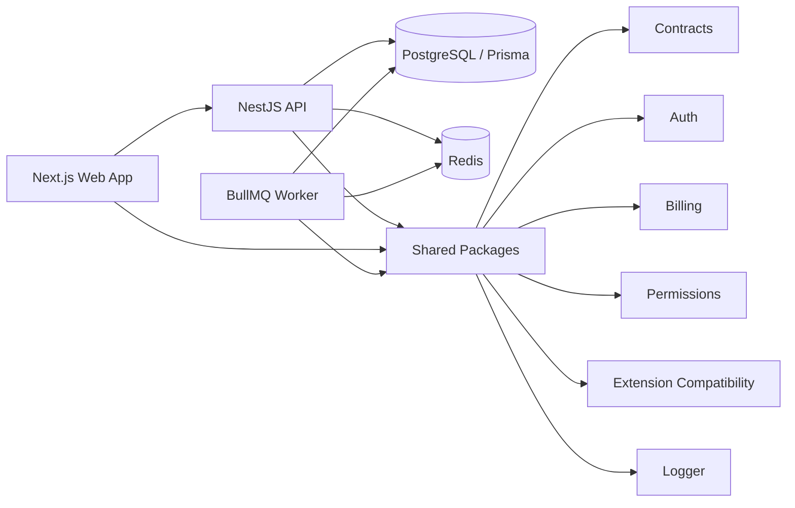

# QuizMind Platform

<p align="center">
  <b>Collaborative full-stack control-plane platform for QuizMind</b><br />
  Next.js web app · NestJS API · BullMQ worker · Prisma/PostgreSQL · Redis · Docker
</p>

<p align="center">
  <a href="https://nextjs.org/"></a>
  <a href="https://nestjs.com/"></a>
  <a href="https://www.typescriptlang.org/"></a>
  <a href="https://www.prisma.io/"></a>
  <a href="https://www.postgresql.org/"></a>
  <a href="https://redis.io/"></a>
  <a href="https://www.docker.com/"></a>
</p>

> This is a **collaborative project / contributed fork**. The fork relationship is intentionally preserved so the real development history stays visible, including the commit history that shows my main work on this fork.

## Overview

QuizMind Platform is a monorepo foundation for a SaaS-style control plane around a quiz/learning product. It combines a web dashboard, backend API, background workers, shared domain packages, database schema, support workflows, billing primitives, feature flags, remote configuration, and extension compatibility policies.

The project is useful as a portfolio example because it shows work with a real multi-application architecture instead of a single isolated demo app.

## My contribution

Most of the visible development history in this fork is authored by me. I keep the repository as a fork to make the collaboration context and commit history transparent instead of re-uploading the same code as a new repository without history.

My work in this fork focused on turning the project into a stronger platform-style monorepo and included:

- evolving the monorepo structure around `apps/web`, `apps/api`, `apps/worker`, and shared `packages/*` boundaries;
- working across the Next.js web app, admin/dashboard areas, and support-oriented UI flows;
- extending NestJS API modules and shared domain packages for auth, billing, permissions, feature flags, remote config, extension compatibility, logging, queues, and support/admin workflows;
- connecting Prisma/PostgreSQL-backed runtime flows for auth, workspaces, billing, admin users, remote config, extension bootstrap, support tickets, and operator support sessions;
- maintaining Docker-based local infrastructure with PostgreSQL, Redis, API, web, worker services, health checks, environment examples, and runbooks;
- improving reliability through TypeScript type checks, workspace scripts, tests, validation, and clearer operational documentation.

## What this project demonstrates

- **Full-stack platform architecture** with a Next.js web app, NestJS API, BullMQ worker, and shared packages.
- **Backend product domains**: auth, workspaces, billing, RBAC/ABAC, entitlements, feature flags, remote config, extension compatibility, audit/security events, and support workflows.
- **Database-backed runtime** with Prisma, PostgreSQL, migrations, seed data, demo users, and repository-backed API flows.
- **Operational setup** with Docker Compose for PostgreSQL, Redis, API, web, and worker services.
- **Team-oriented monorepo structure** using pnpm workspaces, Turborepo-style scripts, shared contracts, and typed package boundaries.

## Architecture



## Main applications

| Area | Path | Purpose |
|---|---|---|
| Web app | `apps/web` | Next.js application for landing pages, auth flows, dashboard, and admin/support surfaces. |
| API | `apps/api` | NestJS backend for auth, billing, RBAC, feature flags, remote config, extension compatibility, support/admin APIs, and connected Prisma flows. |
| Worker | `apps/worker` | BullMQ worker for background jobs, scheduled tasks, billing/notification workflows, quota resets, and config propagation. |
| Shared packages | `packages/*` | Reusable contracts, permissions, auth, billing, extension, logger, config, database, email, queue, provider, usage, and UI boundaries. |
| Documentation | `docs/*` | Architecture, data model, API surface, service composition, remote config, billing, web app, support, and Docker/platform runbooks. |

## Product modules

- Authentication, sessions, refresh/logout flows, email verification, and workspace membership.
- Role and permission foundations: system roles, workspace roles, RBAC/ABAC, and entitlement-aware access control.
- Billing primitives: subscriptions, entitlements, add-ons, overrides, wallet and usage-related domain models.
- Feature flags, remote config layers, extension version compatibility, and bootstrap policies.
- Admin and support surfaces: user directory, support ticket queue, ticket workflow transitions, operator support sessions, handoff notes, favorite queue presets, and audit-backed timeline history.
- Audit, activity, domain, telemetry, security-event, and structured logging foundations.

## Tech stack

| Layer | Technologies |
|---|---|
| Frontend | Next.js, React, TypeScript, shared UI package |
| Backend | NestJS, TypeScript, workspace packages, typed contracts |
| Database | Prisma, PostgreSQL, migrations, seed data |
| Background jobs | BullMQ, Redis, worker service |
| Infrastructure | Docker, Docker Compose, health checks, environment examples |
| Tooling | pnpm, Turborepo-style workspace scripts, TypeScript type checking, Node test runner, Prettier |

## Repository structure

```text
apps/
  web/       # Next.js application
  api/       # NestJS backend
  worker/    # BullMQ background worker
packages/
  auth/
  billing/
  config/
  contracts/
  database/
  email/
  extension/
  logger/
  permissions/
  providers/
  queue/
  secrets/
  ui/
  usage/
docs/
  architecture.md
  api-surface.md
  billing-flow.md
  control-plane-primitives.md
  data-model.md
  foundation-roadmap.md
  remote-config-flow.md
  service-composition.md
  support-flow.md
  web-app-flow.md
infra/
scripts/
```

## Quick start

### Prerequisites

- Node.js with Corepack enabled
- pnpm `10.x`
- Docker and Docker Compose for the full connected runtime

### Install dependencies

```bash
corepack enable
pnpm install
```

### Run checks

```bash
pnpm lint
pnpm typecheck
pnpm test
pnpm build
```

### Start local development mode

```bash
pnpm dev
```

Default local services:

- Web: `http://localhost:3000`
- API: `http://localhost:4000`
- Worker: starts in mock-friendly mode by default

## Connected Docker runtime

The Docker setup starts the full local platform stack:

- PostgreSQL 16
- Redis 7
- API service
- Web service
- Worker service

```bash
docker compose up --build
```

Default Docker ports:

| Service | URL / Port |
|---|---|
| Web | `http://localhost:3000` |
| API | `http://localhost:4000` |
| PostgreSQL | `localhost:5432` |
| Redis | `localhost:6379` |

On container startup, the API applies Prisma migrations and seeds demo data automatically. The worker waits for the API and backing services to become healthy before starting.

For more details, see:

- [`docs/docker-guide.md`](docs/docker-guide.md)
- [`docs/site-platform-extension-connection-runbook.md`](docs/site-platform-extension-connection-runbook.md)

## Database setup

For manual local database work:

```bash
corepack pnpm --filter @quizmind/database db:migrate:dev
corepack pnpm --filter @quizmind/database db:seed
```

Demo personas are available after seeding; see the seed data and local runbooks for the current development credentials.

## Demo personas

The web app supports role-oriented demo views via query parameters:

- `platform-admin` — full dashboard and admin visibility.
- `support-admin` — support workflows plus limited admin visibility.
- `workspace-viewer` — dashboard-only experience with admin denial state.

Examples:

```text
/app?persona=platform-admin
/admin?persona=workspace-viewer
```

## API and runtime highlights

Connected mode includes Prisma-backed foundations for:

- `register`, `login`, `refresh`, `logout`, `/auth/me`, and email verification.
- `GET /workspaces` and `GET /billing/subscription`.
- `GET /admin/users` and admin user directory UI.
- `GET /admin/feature-flags`.
- `POST /admin/remote-config/publish`.
- `POST /extension/bootstrap` for compatibility policy, feature flags, active remote config layers, and workspace subscription plan.
- Support sessions, ticket queues, ticket ownership/workflow transitions, handoff notes, audit-backed timeline history, and operator favorite presets.

## Documentation map

- [`docs/architecture.md`](docs/architecture.md) — high-level platform architecture.
- [`docs/data-model.md`](docs/data-model.md) — domain and database model notes.
- [`docs/api-surface.md`](docs/api-surface.md) — API surface overview.
- [`docs/service-composition.md`](docs/service-composition.md) — service/module boundaries.
- [`docs/remote-config-flow.md`](docs/remote-config-flow.md) — remote config publishing flow.
- [`docs/billing-flow.md`](docs/billing-flow.md) — billing and entitlement flow.
- [`docs/web-app-flow.md`](docs/web-app-flow.md) — web application flow.
- [`docs/support-flow.md`](docs/support-flow.md) — support and operator workflows.
- [`docs/foundation-roadmap.md`](docs/foundation-roadmap.md) — planned platform foundation milestones.

## Status

This repository is an evolving platform foundation. Several connected Prisma-backed flows are implemented, while some platform modules remain intentionally structured as roadmap-ready primitives.

## Why it matters for review

For recruiters or engineering reviewers, this project demonstrates practical exposure to:

- monorepo organization;
- typed full-stack TypeScript development;
- backend service boundaries;
- authentication and authorization concepts;
- database schema design;
- Dockerized local infrastructure;
- support/admin workflows;
- platform-style product thinking.
